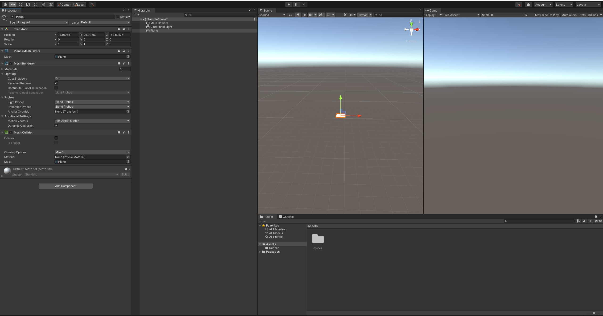

# DEV-01, Game Design and Creating a new Project
#### Tags: [player experience, creating objects, certaing scripts, exporting]

## What do we want the player to go through?

### Player Experience:
+ Careful?
+ Clever?
+ Nimble?

### Core Mechanic:
Move & dodge obstacles

### Game Loop:
Get from A to B

#

## How to Create a new Unity 3d Project

+ Creating new project

+ Current preferred layout

#

## How to Add a Plane

`Right click on Hierarchy Space > 3D Object > Plane`

#

## Moving and manipulating the plane

+ Use Move Tool to move the plane on:
    + y axis (green)
    + x axis (red)
    + z axis (blue)

+ Use Rect Tool to stretch the plane:
+ Hold Shift while holding one of the corners for the shape to scale as it streches

+ Use Rotate Tool to rotate the plane along:
    + y axis (green)
    + x axis (red)
    + z axis (blue)

+ Before you work on any object, be sure to reset the transform by right clicking at the three dots

#

## Create a script for our player

+ Create a new cube, renamed it, created a Scripts folder
+ Added a script called Mover to the Scripts folder

+ Dragged the newly created script to the Inspector space

#

## How to export your work

+ export your work after every session to back stuff up