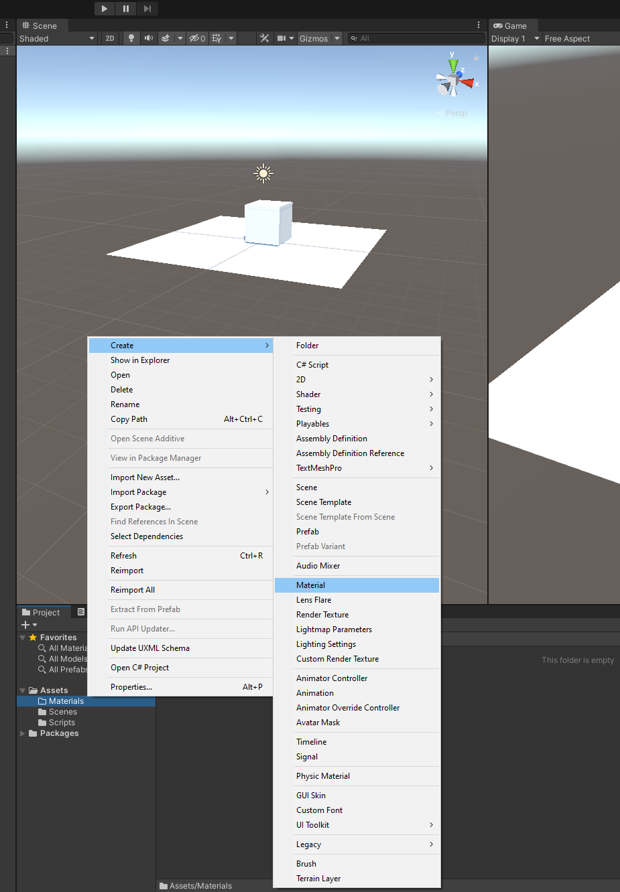

# DEV-02, Creating materials
#### Tags: [materials]

## How to create Materials

+ Create a nerw folder called Materials to store our materials

+ In the Materials folder `Right click > Create > Material`

+ Drag the material to the object in the Scene and you should se the material section be ready for use in the Inspector