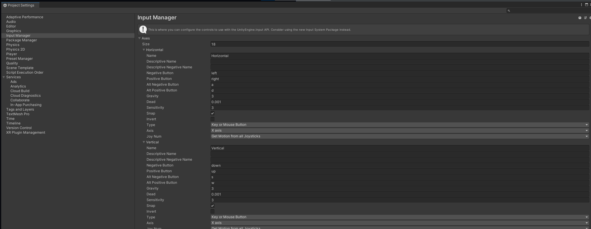
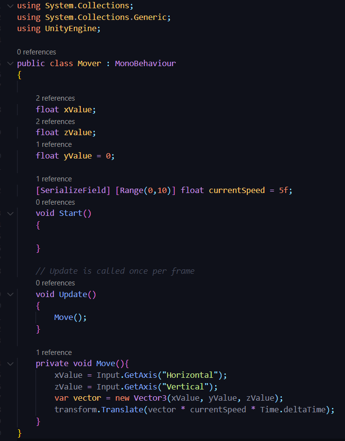

# DEV-03, Input Manager and keyboard Input
#### Tags: [Input Manager, Keyboard Input, Time]

## How to access Input Manager

`Edit > Project Settings`

## Script, added movement
+ We use Time.deltaTime to make sure that unity can tell us how long each frame took to execute
+ When we multiply something by Time.deltaTime, it makes our game "frame rate independent"
+ The game behaves the same on fast and slow computers.

