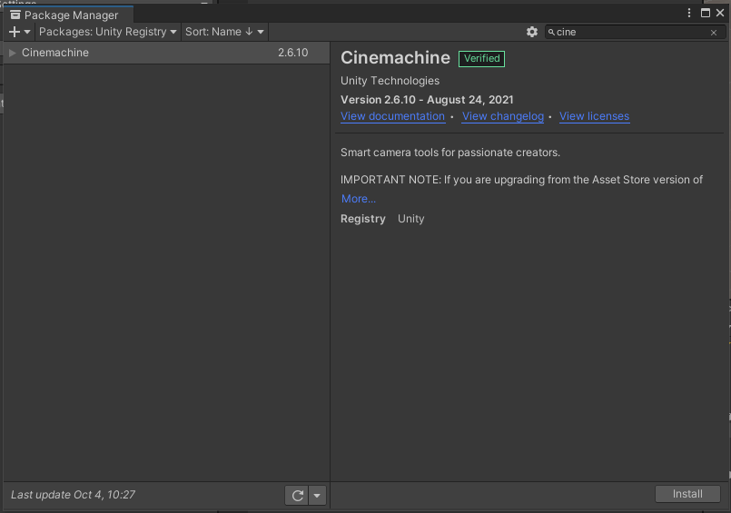
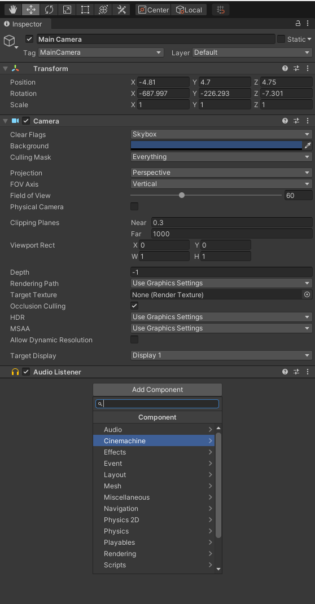
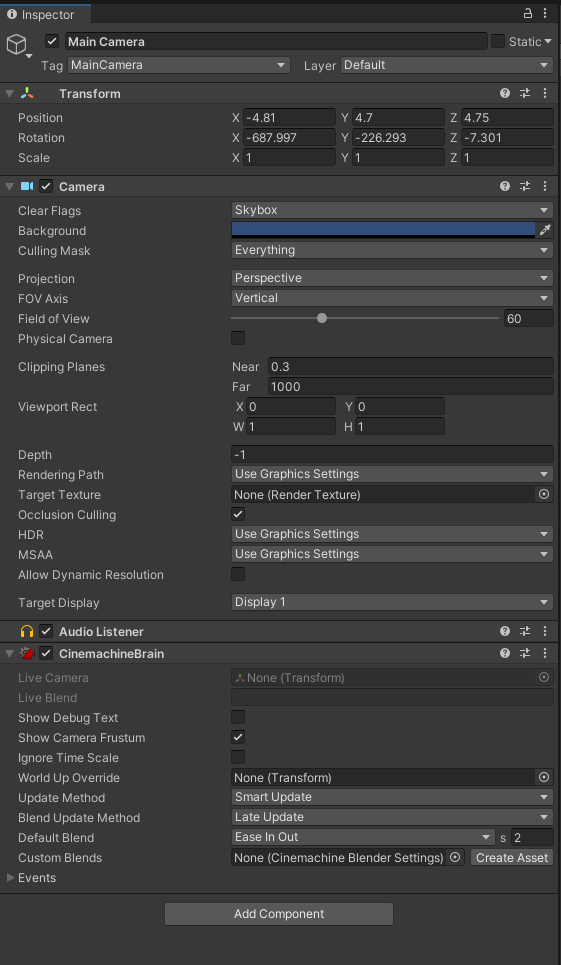
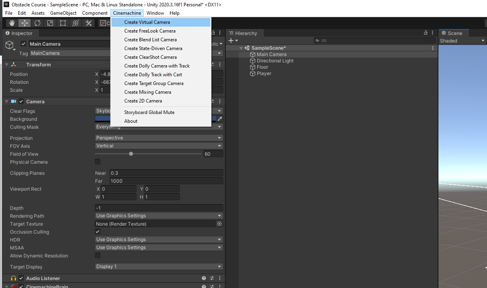
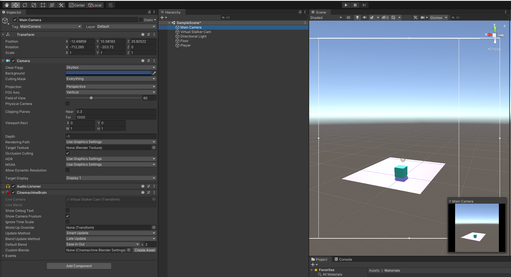
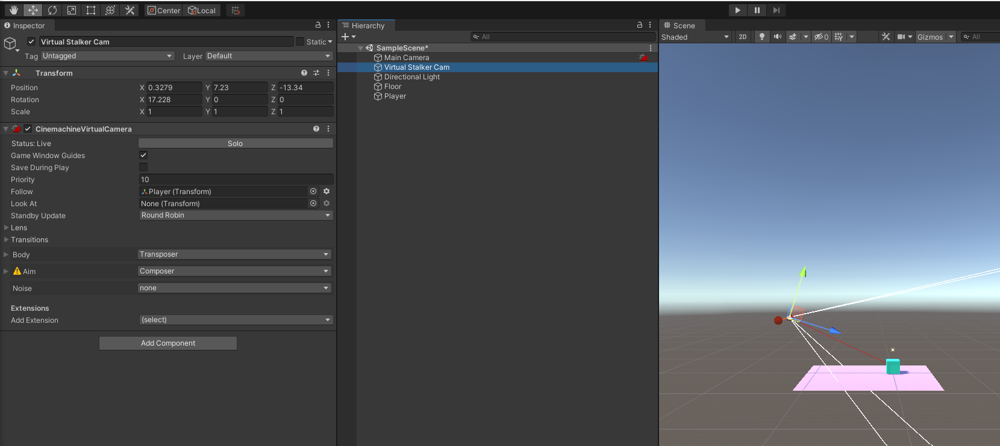
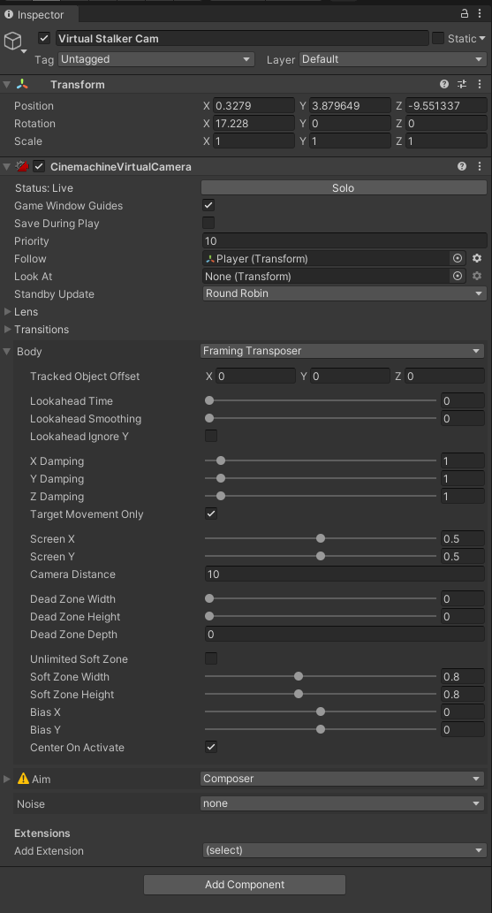

# DEV-04, Cinemachine Follow Camera
#### Tags: [camera movement, Cinemachine]

## What is Cinemachine?
+ Cinemachine is a powerful package that lets us:
    + manage multiple cameras in our scene
    + easily create rules for our cameras

+ To install goto 

    `Windows >`

    `Package Manager >` 

    `Under the dropdown of where it says 'Packages: In Project', change it to say 'Packages: Unity Registry' >`

    `Find Cinemachine in the seach bar and then install`

+ In the Inspector, find CinemachineBrain

+ Click on the CineMachine Tab on top and create a Virtual Camera

https://docs.unity3d.com/Packages/com.unity.cinemachine@2.3/manual/index.html

+ Change the follow property to follow the Player

+ You can choose what you want to follow 

+ You can change the distance from the camera to the thing you are following with this setting: `Framing Transposer`

Some inspriations:

    Game Development teams:
    Sora Ltd and Team Cherry

    Story Telling and World Building
    Eiichiro Oda and YokoTaro

    Music:
    Masayoshi Soken and Christopher Larkin

